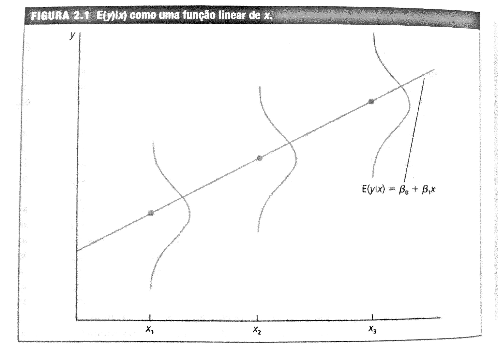
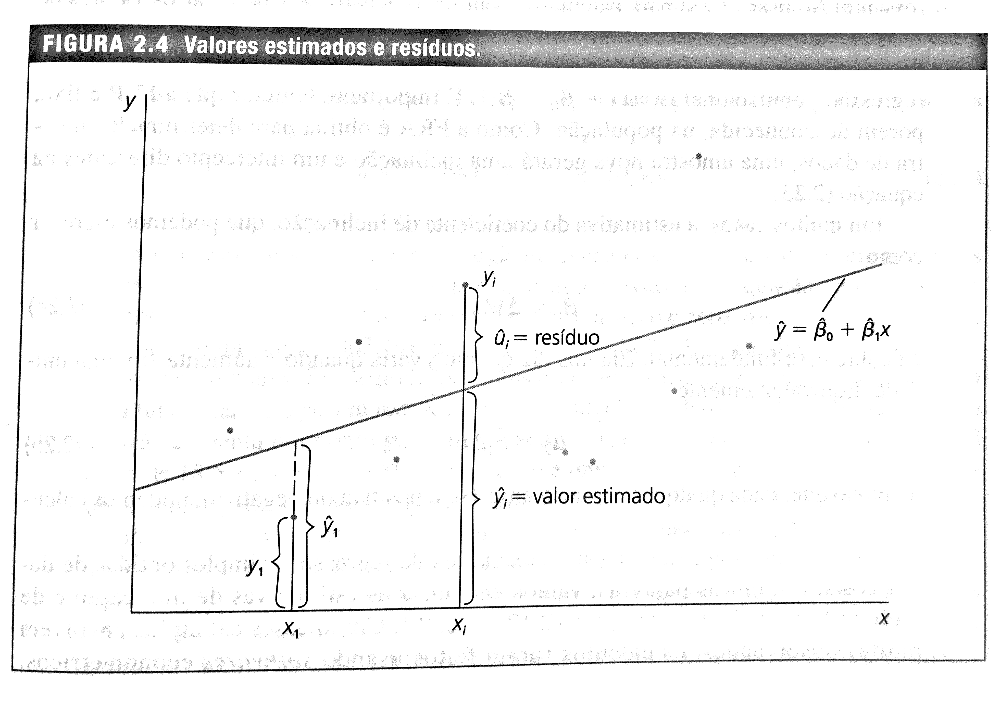

<br>

# Modelos de Regressão Simples

<br>

## Definição do Modelo de Regressão Simples

<br>

O modelo de regressão simples pode ser usado para estudar a relação entre duas variáveis. Em outras palavras, quando se pretender analisar como "y" varia quando "x" mudar;

Considere duas variáveis "y" e "x" que representam alguma população. A equação abaixo relaciona as duas variáveis:

$$
	y=\beta_0+\beta_1x+u
$$

A equação acima é válida para a população de interesse e chamada de **modelo de regressão linear simples**. Pode ser também chamada de regressão bivariada ou de duas variáveis.

Quando relacionadas como acima, as variáveis *x e *y* podem ser denominadas de diversas formas:

``` {r, include=FALSE}
#https://tableconvert.com/latex-to-markdown
```

<center>Tabela 1: Terminologia para a regressão simples: </center>


| Y                    | X                     |
|:--------------------:|:---------------------:|
| Variável Dependente  | Variável Independente |
| Variável Explicada   | Variável Explicativa  |
| Variável de Resposta | Variável de Controle  |
| Variável Prevista    | Variável Previsora    |
| Regressando          | Regressor             |
  

O termo covariável também pode ser usado para x. O mais comum é variável dependente e independente.

Se os outros fatores são fixos, sua variação é zero, ou seja, $\Delta u=0$. Assim, x tem um efeito linear sobre y:

$$
\Delta y=\beta_1 \Delta x \quad se \quad \Delta u=0
$$

A variação em y é, simplesmente, $\beta_1$ multiplicado pela variação em x. Isso significa que $\beta_1$ é o **parâmetro de inclinação** da relação entre y e x, mantendo fixos os fatores em u;


O **parâmetro de intercepto** $\beta_0$ é chamado de constante do modelo. 

O coeficiente de inclinação mede a taxa (parcial) da mudança no valor médio de y para uma mudança de uma unidade no valor da variável independente, tudo o mais constante; 

O termo de erro **u** representa todas aquelas variáveis que não podem estar explícitas no modelo por razões diversas. Contudo, se assume que a influência destas sobre o regressando é insignificante;

Pode-se entender o termo de erro como os fatores não observados que afetam y. 

<br>

## Hipóteses do Modelo Clássico de Regressão Linear

<br>

Em relação ao termo de erro, é necessário fazer uma hipótese que restrinja a relação dele com a variável independente (x);

Como u e x são variáveis aleatórias, pode-se definir a distribuição condicional de u dado qualquer valor de x. A hipótese para se estimar um modelo de regressão com betas confiáveis é 
		
$$
E(u|x)=E(u)=0
$$
		
O que está indicado na equação acima é que o valor médio de u é o mesmo para qualquer valor de x e igual a sua média aritmética. Em outras palavras, diz que u é **independente da média** de x. 

Considerando o valor esperado da equação de Y em função de X e usando $E(u|x)=0$, se obtém: 
		
$$
E(y|x)=\beta_0+\beta_1x
$$
		
A equação dada acima mostra que a **função de regressão populacional (FRP)**, $E(y|x)$, é uma função linear de x;
	
A linearidade significa que o aumento de uma unidade em x faz com que o valor esperado de y varie segundo a magnitude de $\beta_1$;

Para qualquer valor dado de x, a distribuição de y está centrada ao redor de $E(y|x)$. 

{width=85%}

Fonte: WOOLDRIDGE, 2017

<br>

## Derivação das estimativas de Mínimos Quadrados Ordinários (MQO)

<br>

Para estimar o Modelo de Regressão Linear, ou seja, encontrar os parâmetros $\beta_0$ e $\beta_1$ da primeira equação acima o método mais usado é o dos Mínimos Quadrados Ordinários (MQO), pois é intuitivamente e matematicamente mais simples; 

Dado que um Modelo de Regressão:

$$
Y=\widehat{\beta}_0+\widehat{\beta}_1X+\widehat{u}
$$

pode ser definido também como:

$$
\widehat{Y}=\widehat{\beta}_0+\widehat{\beta}_1X
$$

em que o "chápeu" sobre Y, os betas e u enfatiza que os valores são estimativas.

Pode-se reescrever de forma que: 

$$
Y=\widehat{Y}+\widehat{u}
$$

ou ainda:  

$$
\widehat{u}=Y-\widehat{Y}
$$  

então, um método bom para se obter as estimativas dos $\beta$s seria fazer com que a soma de todos os erros fosse a menor possível; 

{width=85%}

Fonte: WOOLDRIDGE, 2017

Por questões teóricas, o método dos Mínimos Quadrados Ordinários (MQO) minimiza a soma dos erros ao quadrado, dando peso diferente às observações cujo valor estimado esteja mais próximo ou mais distante do valor observado ($Y$); 

Assim, o que se precisa é minimizar uma função conhecida como Soma de Quadrados dos Resíduos (SQR): 

$$
min \sum\widehat{u}^2=\sum(Y-\widehat{\beta}_0-\widehat{\beta}_1X)^2
$$


$$
\frac{\partial\sum u^2}{\partial \beta_0}=2\sum(Y-\hat{\beta_0}-\hat{\beta_1}X)(-1)=-2\sum(Y-\hat{\beta_0}-\hat{\beta_1}X)
$$


$$	
\frac{\partial\sum u^2}{\partial \beta_1}=2\sum(Y-\hat{\beta_0}-\hat{\beta_1}X)(-X)=-2\sum(Y-\hat{\beta_0}-\hat{\beta_1}X)(X)
$$

Igualando as derivadas a zero, tem-se

$$	
-2\sum(Y-\hat{\beta_0}-\hat{\beta_1}X)=0
$$

$$	
-2\sum(Y-\hat{\beta_0}-\hat{\beta_1}X)(X)=0
$$

Se dividir tudo por -2N, tem-se

$$
	\frac{\sum(Y-\hat{\beta_0}-\hat{\beta_1}X)}{N}=0
$$

$$
	\frac{\sum(Y-\hat{\beta_0}-\hat{\beta_1}X)(X)}{N}=0
$$


\item Usando o operador do somatório tem-se:

$$
\overline{Y}=\hat{\beta_0}+\hat{\beta_1}\overline{X}
$$

$$
\hat{\beta_0}=\overline{Y}-\hat{\beta_1}\overline{X}
$$

Uma vez que se tenha $\hat{\beta_1}$, dados os valores das médias de Y e X se obtém o valor de $\hat{\beta_0}$.

Considerando a outra equação, mas suprimindo o N, que não afeta a solução, se pode obter:

$$	
\sum(Y-(\overline{Y}-\hat{\beta_1}\overline{X})-\hat{\beta_1}X)(X)=0
$$

$$	
\sum(X)(Y-\overline{Y})=\sum(X)(-\hat{\beta_1}\overline{X})+\hat{\beta_1}X=0
$$

Como $\hat{\beta_1}$ é uma constante e colocando em evidência:

$$	
\sum(X)(Y-\overline{Y})=\hat{\beta_1}\sum(X)(X-\overline{X})
$$

Das propriedades do somatório, se tem que:

$$
\sum(X)(Y-\overline{Y})=\sum(X-\overline{X})(Y-\overline{Y})
$$

$$
\sum(X)(X-\overline{X})=\sum(X-\overline{X})^2
$$

Então, desde que $\sum(X-\overline{X})^2>0$, a inclinação estimada é

$$
\hat{\beta_1}=\frac{\sum(X-\overline{X})(Y-\overline{Y})}{\sum(X-\overline{X})^2}
$$

$$
\hat{\beta_1}=\frac{\sum xy}{\sum x^2}
$$

com $x=X-\overline{X}$ e $y=Y-\overline{Y}$.

A equação dada em acima é a covariância amostral de x e y dividida pela variância amostral de x. Podemos reescrever a forma de encontrar o $\hat{\beta}_1$ como abaixo:

$$
\hat{\beta_1}=\frac{cov(xy)}{\hat{\sigma}_x     \hat{\sigma}_x}\frac{\hat{\sigma}_y}{\hat{\sigma}_y}
$$

$$
\hat{\beta_1}=\frac{cov(xy)}{\hat{\sigma}_x \hat{\sigma}_y}\frac{\hat{\sigma}_y}{\hat{\sigma}_x}
$$

$$
\hat{\beta_1}=\hat{\rho}_{xy}\frac{\hat{\sigma}_y}{\hat{\sigma}_x}
$$

Em que $\hat{\rho}_{xy}$ é a correlação amostral entre x e y; e $\hat{\sigma}_y$ e $\hat{\sigma}_x$ são os desvios padrões amostrais. Se a correlação de x e y for positiva, $\hat\beta_1>0$ e se for negativa,  $\hat\beta_1<0$.

Uma vez determinados os estimadores de intercepto e inclinação de MQO (Mínimos Quadrados Ordinários), se constrói a **reta de regressão de MQO**:

$$
\hat{y}=\hat{\beta}_{0}+\hat{\beta}_{1}x
$$

A função dada em acima é chamada de função de regressão amostral (FRA), pois ela é uma versão estimada da função de regressão populacional $E(y|x)=\beta_{0}+\beta_1x$. 

Como a FRA é obtida para determinada amostra de dados, uma amostra diferente irá gerar um intercepto e um coeficiente de inclinação diferentes. 

<br>

## Exemplo da Regressão Simples

<br>

Com os dados de CEOSAL1, estimar a regressão entre salario anual em milhares de dólares (salary) de diretores executivos e retorno médio sobre o patrimônio líquido (roe), que é dado como uma \% do patrimônio líquido.

<br>

## Exemplo no R {-}
### Diretório e Carregamento dos pacotes {-}

<br>

``` {r pacotes, warning=FALSE, message=FALSE}
#Verificando o diretorio que o R está direcionado
getwd()

#Direcionado o R para o Diretorio a ser trabalhado
setwd('C:/Users/Joao Ricardo Lima/Dropbox/tempecon/Facape/econometria1')

#Limpa o Ambiente Global
rm(list=ls())

#Pode usar dados de outros softwares
library(wooldridge)
library(ggplot2)
library(dplyr)
library(rstatix)
```
<br>

### Entrada dos dados {-}

<br>

``` {r econ1, warning=FALSE, message=FALSE}

#Carregar dados no computador
ceolsal1 <- data('ceosal1')

#Observar a estrutura dos dados
glimpse(ceosal1)
```

<br>

### Estatística Descritiva {-}

<br>

A primeira análise é sobre as estatísticas descritivas das duas variáveis.

``` {r econ2, warning=FALSE, message=FALSE}
attach(ceosal1)

#Estatistica Descritiva dos Dados
summary(salary)
summary(roe)
```

<br>

### Estimação do Modelo {-}

<br>

Em seguida, a análise de regressão simples:

``` {r econ3, warning=FALSE, message=FALSE}
#Estimar a regressao com intercepto
regressao1 <- lm(salary ~ roe, data=ceosal1)

#Resultados da Regressao
summary(regressao1)
```

<br>

### Gráfico do Modelo Estimado {-}

<br>

``` {r econ4, warning=FALSE, message=FALSE}
g1 <- ggplot(data = ceosal1, aes(x = roe, y = salary)) +
  geom_point() +
  stat_smooth(method = "lm", col = "dodgerblue3") +
  theme(panel.background = element_rect(fill = "white"),
        axis.line.x=element_line(),
        axis.line.y=element_line()) +
  ggtitle("Modelo Linear Estimado")

g1
```

<br>

### Fazer previsão com base no modelo estimado {-}

<br>

Com base no modelo estimado é possível fazer previsões. Se $roe=30$, quanto seria o salário estimado?

``` {r econ5, warning=FALSE, message=FALSE}
predict(regressao1, data.frame(roe = 30))
```
