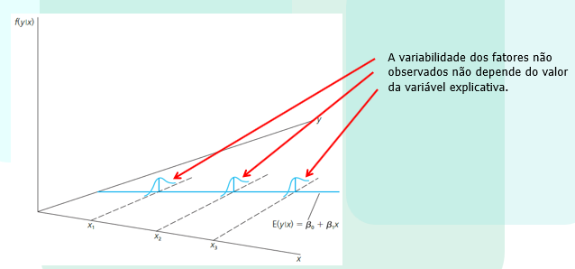

<br>

# Intervalo de Confiança

<br>

Alguns softwares (como o R), calculam um intervalo de confiança para cada coeficiente estimado da regressão.

Um intervalo de confiança para um $\beta_k$ qualquer é dado por
		
\begin{equation} 
Pr[\beta_k \pm t_\alpha/_2 ep(\beta_k)]=(1-\alpha)
\tag{1}
\end{equation}

com $\alpha$ sendo o nível de significância, Pr a probabilidade e $t_\alpha/_2$ o valor da estatística t obtido na tabela t de Student e $ep(\beta_k)$ o erro padrão de $\beta_k$.

## Demonstração no R - Intervalo de Confiança

<br>
	
``` {r pacotes, warning=FALSE, message=FALSE}
#Direcionado o R para o Diretorio a ser trabalhado
setwd('C:/Users/Joao Ricardo Lima/Dropbox/tempecon/Facape/econometria1')

#Limpa o Ambiente Global
rm(list=ls())

#Pode usar dados de outros softwares
library(wooldridge)
library(dplyr)
library(htmltools)
library(knitr)
library(kableExtra)
library(tseries)

#Carregar dados no computador
data('ceosal1')

# Estimação do Modelo
regressao1 <- lm(salary ~ roe, data=ceosal1)

#Resultados da Regressao
summary(regressao1)

#Quadro da Anova
anova(regressao1)

#Intervalo de Confiança
confint(regressao1) 
```

A interpretação diz que se estimarmos esta equação 100 vezes, em 95 delas o valor da estimativa do ROE estará entre -3.428196 e  40.43057.


```{r aula5_2, warning=FALSE, message=FALSE}

#Intervalo de confiança dos betas estimados

# Valor do t com alfa/2
qt(.975, df=207)

(18.50)-11.12*1.97149
(18.50)+11.12*1.97149
```

<br>
	
# Pressupostos do Modelo Clássico de Regressão Linear

<br>


O Modelo Clássico de Regressão Linear se baseia em algumas hipóteses:

1) O modelo de regressão é linear nos parâmetros;

2) Os regressores são fixos (não aleatórios) em amostras repetidas (análise de regressão é condicional aos valores de X, ou seja, $E(Y|X)$;

3) Dados os valores de X, $E(u|X)=0$; 

Com isso, é possível demonstrar que o estimador de MQO não é viesado: $E(\hat{\beta}_0)=\beta_0$ e $E(\hat{\beta}_1)=\beta_1$. 

**Intepretação de não viesado**

Os coeficientes estimados podem ser menores ou maiores, dependendo da amostra que é o resultado de um sorteio aleatório.

No entanto, em média, eles serão iguais aos valores que caracterizam a verdadeira relação entre y e x na população.

"Em média" significa que, a amostragem foi repetida, ou seja, foram sorteadas amostras aleatórias e repetidas as estimações diversas vezes.

Em uma dada amostra, as estimativas podem diferir consideravelmente dos valores verdadeiros. A demonstração será feita na parte de regressão múltipla.


Continuando com as hipóteses do MCRL, além de saber que a distribuição amostral de $\hat{\beta}_1$ está centrada em torno de $\beta_1$, é importante saber o quão distante, em média, pode-se esperar que  $\hat{\beta}_1$ esteja de $\beta_1$:

4) A variância de cada observação $u$, dados os valores de X, é constante - *homocedástico*:
 
 \begin{equation} 
 var (u|x)=\sigma^2
\tag{2}
\end{equation}

O valor da variável independente não deve conter informação sobre a variabilidade dos fatores não observados.

Como $var(u|x)=E(u^2|x)-[E(u|x)]^2$ e $E(u|x)=0$, $\sigma^2=E(u^2|x)$. 

Portanto, $\sigma^2=E(u^2)=var(u)$, pois $E(u)=0$.

<br>

{width=85%}

Fonte: Wooldridge, 2017.
<br>

Outras hipóteses do MCRL:

5. Não há autocorrelação entre os termos de erro.

\begin{equation}
cov (u_i,u_j|X)=0
\tag{3}
\end{equation}

6. Nao existe multicolinearidade perfeita; 

7. O modelo está corretamente especificado; 

8. Os resíduos seguem a distribuição \emph{Normal}:
  
\begin{equation}
u \sim N(0,\sigma^2)
\tag{4}
\end{equation}

<br>

# Normalidade dos Resíduos

<br>

O MCRL assume que cada $u_i$ é distribuído Normalmente com: 

**Média Zero**

$$
E(u_i)=0
$$
**Variância Constante** 

$$
E[u_i-E(u_i)]^2=E(u_i^2)= \sigma^2
$$

**Covariância Zero** 

$$
E{[(u_i-E(u_i)][u_j-E(u_j)]}=E(u_i,u_j) =0 \quad \forall \quad i\neq j
$$
<br>

ou dito de outra forma

<br>

\begin{equation}
u_i \sim N(0,\sigma^2)
\tag{5}
\end{equation}

<br>

se duas variáveis são normalmente distribuídas e não são autocorrelacionadas, são chamadas de independentes. Assim, pode-se reescrever (5) da seguinte forma: 
 
\begin{equation} 
 u_i \sim IID(0,\sigma^2)
\tag{6}
\end{equation}

<br>

## Teste de Normalidade de Jarque-Bera

<br>

Para se testar Normalidade dos resíduos pode-se fazer um histograma dos resíduos e observar seu comportamento ou fazer o **teste de Jarque-Bera (JB)** de Normalidade dos resíduos. O teste de Jarque-Bera tem como pressuposto que a amostra seja grande. 

<br>

O teste calcula a simetria da distribuição dos resíduos e a Curtose e usa a seguintes estatística de teste: 

<br>

\begin{equation}   
JB=n [\frac{S^2}{6}+ \frac{(K-3)^2}{24}]
\tag{7}
\end{equation}

que segue a distribuição de $\chi^2$ com 2 graus de liberdade. A **hipótese nula** do teste de JB é que *os resíduos seguem a distribuição Normal*.

<br>

### Exemplo no R

<br>

```{r aula5_3, warning=FALSE, message=FALSE}

# Estimação do Modelo
regressao1 <- lm(salary ~ roe, data=ceosal1)

#Teste de Normalidade de Jarque-Bera - precisa do pacote tseries
jarque.bera.test(regressao1$residuals)
```

Como o valor de probabilidade é menor do que 0,10, rejeitamos a hipótese nula, ou seja, os resíduos não seguem a distribuição Normal.

<br>

## Teste de Normalidade de Shapiro-Wilk

<br>

O teste de Shapiro-Wilk é um teste de normalidade que testa, com base na estatística W, se um conjunto de dados segue a distribuição Normal. A estatística é:

\begin{equation}   
W=\frac{(\sum_{i=1}^{n}a_ix_i)^2}{(\sum_{i=1}^{n}x_i-\bar{x})^2}
\tag{8}
\end{equation}

Em que $x_i$ o menor número da amostra; $\bar{x}$ é a média amostral; as constantes $a_i$ são constantes geradas pelas médias, variâncias e covariâncias das estatísticas de ordem de uma amostra de tamanho n de uma distribuição Normal.

### Exemplo no R

<br>

```{r aula5_4, warning=FALSE, message=FALSE}

# Estimação do Modelo
regressao1 <- lm(salary ~ roe, data=ceosal1)

#Teste de Normalidade de Shapiro-Wilk
shapiro.test(regressao1$residuals)
```

Como o valor de probabilidade é menor do que 0,10, rejeitamos a hipótese nula, ou seja, os resíduos não seguem a distribuição Normal.

<br>

## Outras análises que podem ser feitas com os resíduos

<br>

```{r aula5_5, warning=FALSE, message=FALSE}
#Salvando os residuos do modelo e os valores estimados
residuos1 <- regressao1$residuals
ajustados1 <- regressao1$fitted.values

# Fazendo um gráfico para verificar algum padrão
plot(ajustados1, residuos1)

# Outra possibilidade de gráfico para verificar algum padrão
residuos_quad1 = (residuos1)^2
plot(residuos1, residuos_quad1)

#Outras análises de resíduos

#Gráfico QQ
qqnorm(residuos1)
qqline(residuos1)

hist(residuos1) #histograma dos resíduos
