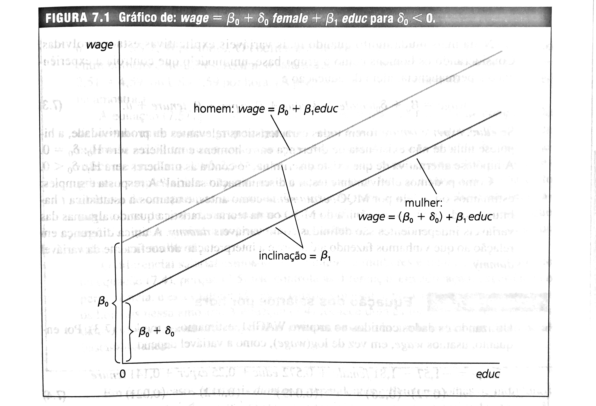
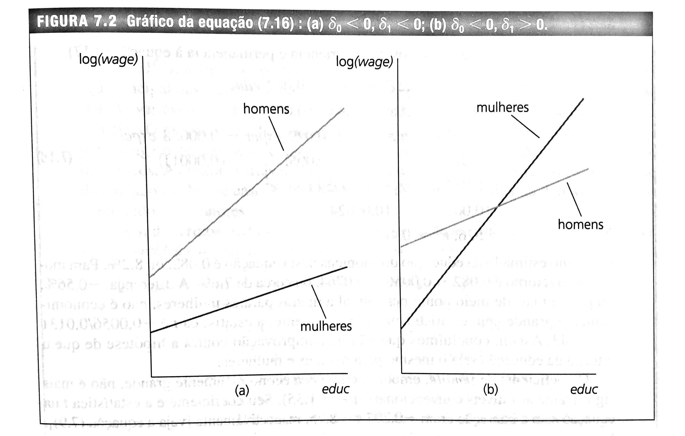

<br>

# Variáveis Qualitativas em Modelos de Regressão

<br>

Até o momento as variáveis independentes usadas nos modelos eram quantitativas. Contudo, em análise de regressão sempre serão encontradas variáveis de natureza qualitativa: gênero, raça, cor, religião, região geográfica, filiação partidária, etc.

Estas variáveis qualitativas não possuem um determinado valor numérico. Porém, podem ser quantificadas criando variáveis binárias (**dummies**) que assuem 2 valores, normalmente 0 e 1, se não possui ou se possui um determinado atributo.

**Exemplos:** **feminino=1 (feminino)** ou **=0 (masculino)**

**Nordeste=1 (Região Geográfica brasileira, Nordeste)** ou **=0 (caso contrário, ou seja, qualquer outra região brasileira)**

A primeira questão é definir qual evento será atribuído o valor 1 e qual será o valor zero. Em geral, o nome da variável indica qual evento tem valor 1. A categoria cujo valor é igual a zero é chamada de referência. As comparações são realizadas em relação à categoria de referência. Como as dummies assumem valores 0 e 1, não podem ser logaritmizadas. Se a amostra é muito pequena, deve-se ter cuidado ao incluir muitas variáveis dummy, pois cada uma custa 1 grau de liberdade. 
	
## Exemplo de Base de Dados com variáveis dummy:

``` {r aula7_1, warning=FALSE, message=FALSE}
library(wooldridge)
library(kableExtra)
library(dplyr)
# Carrega a base 'wage2'
data(wage1)

# Remove os valores ausentes (NAs)
sal <- na.omit(wage1)

# Cria um subgrupo
sal2 <- cbind(sal$lwage, sal$female, sal$nonwhite, sal$married, sal$educ, sal$exper)

kable(head(sal2, 10), align='cccccc', col.names = c("Log(Salário)", "Feminino", "Não Branco", "Casado", "Anos Escolaridade", "Anos Experiência")) %>% 
  kable_styling(full_width=TRUE, position = "center")
```

Considere a regressão:  

$$ 
wage=\mathbf{\hat \beta_0} + \mathbf{\hat \delta_0} female + \mathbf{\hat \beta_1}educ + u
$$

Na  equação anterior, o $\delta_0$ é a diferença no salario por hora entre mulheres e homens, dado o mesmo grau de educação. Assim, ele vai dizer se existe discriminação com as mulheres. Se $\delta_0$ for $< 0$, então, para o mesmo nível dos outros fatores, as mulheres ganham menos do que os homens, na média.
  
Graficamente, é como se houvesse um deslocamento de intercepto entre as linhas que representam homens e mulheres, como mostra o livro do Wooldridge (2017). Se o intercepto está incluído no modelo e se uma variável qualitativa tem **m** categorias, então, inserir apenas **m-1** variáveis *dummy*. Se não seguir esta regra, cairá na **armadilha da variável dummy**, que é um caso de correlação perfeita, dado que o intercepto é equivalente a um regressor cujo valor é uma constante = a 1.

{width=85%}
<br>

## Estimação do Modelo no R

<br>

``` {r aula7_2, warning=FALSE, message=FALSE}

reg1 <- lm (wage ~ female + educ, data=sal)
summary(reg1)
```

<br>

Assim, o valor de -2,27336 é a diferença no salário por hora entre mulheres e homens, dado o mesmo grau de educação. Como o valor é negativo, as mulheres ganham US\$ 2,27 dólares a menos do que os homens. A regressão, então, tem um intercepto para os homens, igual a US\$ 0,62 e o outro seria das mulheres, igual a US\$ 0,62 - US\$ 2,27= - US\$1,65.

<br>

``` {r aula7_3, warning=FALSE, message=FALSE}

reg2 <- lm (wage ~ female + nonwhite + married + educ + exper, data=sal)
summary(reg2)
```

<br>

O salário médio/hora de uma mulher é 2,07 dólares menor em comparação com os homens, para a mesma raça, ser casado, anos de educação e experiência. O salário dos não brancos é cerca de 0,02 dólares menor do que os dos trabalhadores brancos (contudo, não foi estatisticamente significativo). O salário dos casados é aproximadamente 0,66 dólares maior do que o salário dos não casados. 
 
O que significa o intercepto? E(wage) para o homem, branco e casado, considerando uma interpretação apenas matemática.

<br>

``` {r aula7_4, warning=FALSE, message=FALSE}
sal$educ[sal$educ == 0] <- 0.000001
reg3 <- lm (lwage ~ female + exper + log(educ), data=sal)
summary(reg3)
```

No caso acima, wage está em log. Assim, a interpretação é que as mulheres ganham cerca de 38,3\% a menos do que os homens, para o mesmo nível de educação e experiência.

<br>

# Informações Ordinais

<br>

As vezes as variáveis são ordinais. No próximo exemplo, um entrevistador classificou as pessoas em relação a aparência (média, acima e abaixo da média), sendo que o grupo base era aparência média. Como se tem 3 categorias, duas variáveis dummy foram criadas: acima (belvg) e abaixo da média (abvavg) e incluídas no modelo de regressão com outras variáveis explicativas (educ, exper, married, black, union).

``` {r aula7_5, warning=FALSE, message=FALSE}

# Exemplo considerando apenas os homens na base de dados

data('beauty')

beautyM<-filter(beauty, female == '0')
reg4 <- lm(lwage~belavg+abvavg+educ+exper+married+black+union, data=beautyM) 
summary(reg4)
```

Uma regressão apenas com dados de homens indica que aqueles com aparência abaixo da média ganham 16,48\% a menos do que aqueles com aparência média e tudo o mais igual.

``` {r aula7_6, warning=FALSE, message=FALSE}

# Exemplo considerando apenas as mulheres na base de dados

beautyF<-filter(beauty, female == '1')
reg5 <- lm(lwage~belavg+abvavg+educ+exper+married+black+union, data=beautyF) 
summary(reg5)
```

<br>

Uma regressão apenas com dados de mulheres indica que aqueles com aparência abaixo da média ganham 9,34\% a menos do que aqueles com aparência média e tudo o mais igual.

``` {r aula7_7, warning=FALSE, message=FALSE}

# Exemplo considerando apenas todos na base de dados

reg6 <- lm(lwage~belavg+abvavg+educ+exper+married+black+union, data=beauty) 
summary(reg6)
```

Uma regressão com todos os dados indica que aqueles com aparência abaixo da média ganham 15,82\% a menos do que aqueles com aparência média e tudo o mais igual.

<br>

# Uso de dummies interativas

<br>

O uso de dummies de interação considera 2 ou mais variáveis categóricas. No Exemplo, tem-se a variável de interação mulheres x não brancas para se analisar as diferenças com mulheres, trabalhadores não brancos e homens brancos. É o que se denomina de dummy de intercepto pois gera mudanças no intercepto.

Para mulher, o $\hat \beta$ é igual a -2,79 dólares por hora (wage não está logaritmizado, ou seja, é modelo lin-lin); Para cor preto o $\hat \beta$ é igual a -1,84 dólares por hora; Considerando ambos, é igual a:

$$
-2,79-1,84+3,58=-1,05
$$
Ser mulher e preta, o salário é US\$1,05 menor do que os dos homens e brancos.

``` {r aula7_8, warning=FALSE, message=FALSE}
#Regressão Quadro - Modelo Log-Lin
reg7 <- lm(wage ~ female + black + union + educ + exper + female*black, data=beauty)
summary(reg7)
```

<br>

É possível analisar também mudanças no coeficiente de inclinação!

Considere o modelo log-lin estimado:  

$$
log(wage)=\mathbf{\hat \beta_0} + \mathbf{\hat \beta_1} female + \mathbf{\hat \beta_2} black + \mathbf{\hat \beta_3} union + \mathbf{\hat \beta_4}educ + \mathbf{\hat \beta_5} exper + \mathbf{\hat \beta_6} female*exper + \mathbf{\hat \beta_7} black*exper + \mathbf{\hat \beta_8} union*exper + u
$$
 
$\mathbf{\hat \beta_2}$, $\mathbf{\hat \beta_3}$ e $\mathbf{\hat \beta_4}$ são denominadas de dummies diferenciais de intercepto e $\mathbf{\hat \beta_7}$ até $\mathbf{\hat \beta_9}$ são dummies de diferencial de inclinação.

{width=85%}
``` {r aula7_9, warning=FALSE, message=FALSE}

#Regressão Quadro - Modelo Log-Lin Dummy de inclinação
reg8 <- lm(lwage ~ female + black + union + educ + exper + female*educ + female*black + union*exper, data=beauty)
summary(reg8)
```

O retorno da educação para os homens é de 6,67\%, aproximadamente. Para as mulheres é 0,066679+0,019111=0,08579 ou 8,58\%. A diferença a mais para as mulheres é significativo estatisticamente a 10\% de probabilidade.

O coeficiente female foi estatisticamente significativo e negativo, indicando que as mulheres ganham menos do que os homens. 

# O uso de Dummies para quebras de séries

Existe um teste, chamado de **Teste de Chow**, para verificar se dois períodos de tempo ou dois grupos seguem a mesma função de regressão.

Se houver diferença (quebra estrutural), os valores dos parâmetros do modelo não permanecem o mesmo durante todo o período.

Assim, normalmente, são estimados três modelos, sendo um com todos os dados, outro com uma parte dele (representa um grupo ou uma parte da série temporal) e, finalmente, um último modelo (com os dados do outro grupo ou da outra parte da série temporal).  

A regressão com todos os dados gera uma soma de quadrados do resíduo chamada soma de quadrados restrita (SQRr). As outras duas regressões também geram somas de quadrados (SQR1 e SQR2).

A soma de SQR1 e SQR2 é chamada de Soma de Quadrados Irrestrito (SQRi). Com estes valores é possível fazer um teste F como abaixo.

$$
F=\frac{(SQRr-SQRi)/k}{(SQRi)/(n_1+n_2-2k)} \sim F_{[k,(n_1+n_2-2k)]}
$$
A **Hipótese Nula** do Teste é *ausência de quebra estrutural*, ou seja, as regressões antes e depois de uma data determinada são iguais.

Uma outra possibilidade é gerar uma variável dummy que vai assumir o valor 0 para um determinado grupo ou parte da série temporal e valor 1 para o outro grupo ou parte da série temporal. Fazer a estimação do modelo e incluir a variável dummy de intercepto e de inclinação e checar as significâncias. Se forem significativas, indica que existem diferenças. A diferença pode ocorrer no intercepto, na inclinação ou em ambos. 

A questão aqui é identificar se a quarentena imposta para se obter o achatamento da curva de infectados por COVID-19 está tendo efeito positivo. 
Para isto, foi estimado um modelo com o log do número de infectados contra a tendencia, ou seja, calcular a taxa de crescimento, ao dia, do número de infectados no Brasil. A data escolhida para a quebra é o dia 31 de março por ser 15 dias depois que São Paulo determinou o início de sua quarentena.

A literatura indica que a quarentena começa a ter resultados 15 dias após o seu início. São Paulo foi escolhido por ser o estado com o maior número de casos no Brasil. Ele determinou o dia 16 de março para inicio da quarentena.

``` {r aula7_10, warning=FALSE, message=FALSE}

#Pacotes para utilizar
library(strucchange)
library(zoo)

#Entrando com os dados

infectados<-c(1,1,1,2,2,2,2,3,8,13,19,25,30,34,69,78,98,
              121,200,234,291,428,621,904,1021,1546,1924,2247,
              2554,2985,3417,3904,4256,4579,5717,6836,8044,
              9056,10360,11130,12161,14034,16170,18092,19639,
              20727,22169)

#Série temporal

zoo(infectados, seq(from = as.Date("2020-02-26"), to = as.Date("2020-04-12"), by = 1))

trend<-1:length(infectados)

#H0: ausencia de quebra estrutural, ou seja, as regressões antes e depois
#de uma data determinada são iguais.
# O ponto 35 é escolhido por ser 15 dias depois que SP iniciou a quarentena
# (dia de março). O ponto 35 indica a data de 31 de março. 

sctest(log(infectados)~trend, type = "Chow", point=35)
```

O Teste de Chow mostra que para o valor de F igual 62,072, o valor de probabilidade é muito pequeno, se rejeitando a hipótese nula de ausência de quebra estrutural. 

Em outras palavras, existe uma diferença nas regressões para taxa de crescimento de antes e depois do inicio da quarentena. Contudo, não se sabe se a diferença é no intercepto ou na inclinação.

O uso de variável dummy para delimitar o período antes de 31 de março e depois desta data, pode ser utilizado também para identificar a quebra.

``` {r aula7_11, warning=FALSE, message=FALSE}
#Uso da Variavel Dummy para analise de Quebra Estrutural
dum.x<-rep(0,47)
dum.x[trend>=35]=1

reg9<-lm(log(infectados)~trend+dum.x+trend*dum.x)
summary(reg9)
```


Os resultados mostram que tanto dum.x quanto a interação dum.x com trend são significativos!  Isto significa que existe uma quebra estrutural tanto no intercepto quanto na inclinação e que a inclinação no segundo período é igual a
  
$$
0,287869-0,1775526=0,1103164
$$

A inclinação do segundo período é menor do que no primeiro período. A taxa de crescimento do primeiro período é dada por $exp(0,287869)-1*100=33,36\%$ ao dia. Já para o segundo período é de $exp(0,1103164)-1*100=11,66\%$ ao dia.
