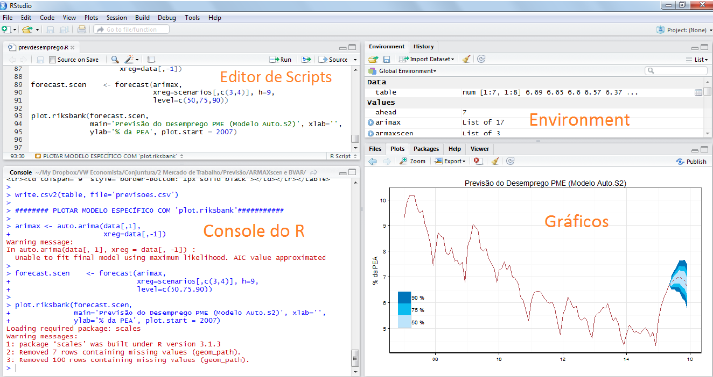

```{r setup, include=FALSE}
knitr::opts_chunk$set(
  echo       = TRUE,
  warning    = FALSE,
  message    = FALSE,
  fig.width  = 10, 
  fig.height = 7,
  fig.align  = "center",
  comment    = "#",
  size       = "normalsize"
  )
```

<br>

# Por que usar o R?

<br>

1)  O R É uma linguagem de programação usada principalmente para estatística computacional;
2)  O R É gratuito;
3)  O R É um substituto mais do que perfeito do Excel; 
4) Existe uma comunidade incrível trabalhando na plataforma. Existem mais de 500 blogs e sites que tratam de R;
5)  É possível unificar todas as operações em um mesmo ambiente, automatizando as rotinas;
6)  Não é uma linguagem voltada apenas para estatísticos;
7)  Liberdade maior para se apresentar os resultados;
8)  O R É excelente para se fazer gráficos de alta qualidade.

<br>

# Instalação do R?

<br>

O R pode ser baixado no site <http://www.r-project.org>. A versão atual é a 4.1.3, mas constantemente são lançadas novas versões. Para uma melhor interface com o usuário, recomenda-se usar um outro software, chamado R-Studio, que pode ser baixado no site <http://www.rstudio.com>. O R deve ser instalado primeiro e depois o R Studio. O R Studio não funciona se o R não tiver sido instalado.

<br>



<br>

Quando se abre o RStudio, é possível ver quatro áreas. Na parte esquerda superior se digita as linhas de comando para o R executar. Na parte esquerda inferior (console) é mostrado o output, ou seja, os resultados. É possível digitar os comandos no console também e funciona como uma calculadora. Na parte direita superior é onde se pode ver uma lista de objetos do R. Na parte direita inferior se pode ver os arquivos, gráficos, pacotes instalados e a ajuda (help).

<br>

# Packages

<br>

O que são "pacotes"? R é construído em torno de pacotes (arquivos que contém comandos para realizar uma tarefa específica), tem uma estrutura (que inclui um número de pacotes) e contribuições de algoritmos feitos por usuários do mundo inteiro. Existem muitos pacotes que já vem no R. Existem também diversas contribuições que não estão embutidas na instalação do R. É necessário ir em locais específicos para encontrá-los:

<br>

a)  CRAN (Central R Network);
b)  GitHub

<br>

## Como acessar as funções dos pacotes

<br>

Após a instalação dos pacotes [`install.packages("nome do pacote")`] é necessário "carregá-lo" para a memória do R. Os pacotes estão intalados mas não são carregados automaticamente. Para carregar, usar o comando `library(nome do pacote)`. Geralmente se coloca todos os pacotes a serem utilizados na parte de cima do script.

Se o pacote não existir no computador, o R retorna uma mensagem de erro -$>$ Error: could not find function "nome do pacote";

O R é "case sensitive", ou seja, se o comando estiver escrito em maiúsculo e a pessoa digitar minúsculo, ele não reconhece. O uso de "#" indica que o escrito na linha é apenas um comentário.

<br>

# Help

<br>

Como usar o Help? A forma mais simples é ?? na frente do que se deseja obter ajuda. Outra possibilidade é recorrer a internet. Existem centenas de sites em português ou inglês com soluções para problemas encontrados em R;

<br>

1)  <https://www.r-bloggers.com/>
2)  <http://stackoverflow.com/>
3)  <https://stats.idre.ucla.edu/r/>
4)  <https://analisereal.com/>
5)  <https://sites.google.com/site/marcosfs2006/>

<br>

# Dicas

<br>

Usando as setas do teclado é possível acessar o histórico de comandos, repetir um comando ou corrigir um comando escrito incorretamente, sem precisar digitar tudo novamente. Tudo no R é um objeto. É como a lógica do programa funciona. Assim, ao invés de tabular um resultado, para o R se está criando uma tabela, por exemplo.

Os objetos do R podem ser variáveis, arranjos de números, funções, etc., sendo criados e armazenados por um nome. Uma coleção de objetos armazenados se chama *workspace*. A lista de objetos armazenados pode ser visualizada com o comando `objects()` ou `list()`.

Os comandos no R são escritos da mesma forma, tendo um nome e, entre parentes, as opções diversas e os dados `nomedafuncao(parte1, parte2, etc)`. A função `rm()` deve ser utilizada para se remover objetos. A função `rm(list=ls()` apaga todos os objetos.

Todos os objetos criados em uma sessão do R podem ser armazenados em um arquivo para uso em sessões futuras. No final de toda sessão, o R pergunta se quer salvar os objetos disponíveis. Caso se queira, o R vai criar um arquivo .RData no diretório e as linhas de comandos serão guardadas em .Rhistory; O ideal é que se tenha um diretório para cada análise realizada no R.

<br>

# R como uma calculadora

<br>

R pode ser usado como uma calculadora, digitando diretamente no "prompt" e apertando "Run" ou Ctrl+Enter:

```{r eco1, warning=FALSE, message=FALSE }

# adição
2+1 

# subtração
2-1 

# multiplicação
2*1 

# divisão
2/1

# potenciação
2^2  
```

Regras normais de cálculo se aplicam:

```{r eco2, warning=FALSE, message=FALSE }

2+2*3

(2+2)*3

```

O R pode gerar números aleatórios

```{r eco3, warning=FALSE, message=FALSE }
x <- rnorm(10, mean=0, sd=1)
```

R contém muitas funções matemáticas:

```{r eco4, warning=FALSE, message=FALSE }
# logaritmo natural, 2.3  
log(10) 

# exponencial
exp(2.3)  

# raiz quadrada
sqrt(9) 
```

R também possui os operadores:

`==` igual

`>` maior

`>=` maior ou igual

`<=` menor ou igual

`!=` diferente

`&` "e"

`|` "ou"

Outros elementos importantes são `max`, `min`, `range` (mostra o menor e o maior valor de um vetor), `length(x)` (mostra o número de elementos no vetor x), `sum(x)` dá o somatório total de elementos em x.

Duas funções estatísticas importantes são a média e variância de uma variável aleatória e podem ser obtidas através dos comandos `mean(x)` e `var(x)`. Uma outra forma de obtê-las é fazendo `sum(x)/length(x)` ou `sum((x-mean(x))^2)/(length(x)-1)`.

`sort` e `sort.list()` são comandos que podem ser utilizados para ordenar dados de forma crescente ou decrescente.

# Vetores

O R funciona com o que se denomina "estrutura de dados". A estrutura mais simples é um vetor numérico, que é um objeto constituído de uma coleção ordenada de números. Normalmente, se deseja realizar uma mesma operação para vários números ao mesmo tempo. Assim, primeiramente é necessário criar um objeto vetor que armazena estes números:

```{r eco5, warning=FALSE, message=FALSE }
v<-c(1,2,3,4,5)
v
```

tudo em R é um objeto, aqui v é um objeto usado para armazenar 5 números, a "seta" é o operador que armazena algo, c() é um comando (função) usado para criar uma lista com os valores a serem guardados.

Vetores podem ser guardados usando `:`, se os valores forem contínuos:

```{r eco6, warning=FALSE, message=FALSE }
v<-c(1:5)

v
```

Para criar um vetor com três numeros 1, quatro 2's, e cinco 3's, existem várias possibilidades:

```{r eco7, warning=FALSE, message=FALSE }

v <- c(1,1,1,2,2,2,2,3,3,3,3,3)

v

# Using rep( ) 

v1<-rep(1,3) #Cria um vetor com três ``um'' 
v2<-rep(2,4) 
v3<-rep(3,5) 
v<-c(v1,v2,v3) 
v

#Reunindo os comandos:
v4<-c(rep(1,3), rep(2,4), rep(3,5))

v4
```

1:30 é a sequência de número de 1 a 30. Se fizer o inverso, 30:1, se tem a sequência de forma decrescente; A função `seq()` tem várias facilidades para se gerar sequências de números.

```{r eco8, warning=FALSE, message=FALSE }
s1 <- seq(-5, 5, by=.2)

s1

s2 <- seq(length=51, from=-5, by=.2)
s2
```

# Vetor aritmético

Vetores podem ser usados em expressões matemáticas, que é o caso em que a operação é feita elemento a elemento;

```{r eco9, warning=FALSE, message=FALSE }
x <- c(10.4, 5.6, 3.1, 6.4, 21.7)
x

y <- c(x, 0, x)
y

v <- 2*x + 1
v
```

Além do que, quando se aplica qualquer função a um determinado vetor (como em v), a função será executada separadamente para cada observação no vetor.

# Valores Faltando

Existem situações que não se tem todos os valores de um vetor, ou seja, ele é um **missing value**. Nos lugares em que existem estes números faltando, aparece um NA (*not available*). Qualquer operação envolvendo um NA se torna um NA: 2\*NA=NA, por exemplo. Para saber se existe algum NA em um objeto, a função `is.na()` é muito útil.

```{r eco10, warning=FALSE, message=FALSE }
z <- c(1:3,NA)
z

ind <- is.na(z)
ind

# Carrega os pacotes
library(wooldridge)
library(kableExtra)
library(dplyr)

# Carrega a base 'wage2'
data(wage2)

rowSums(is.na(wage2)) #Número de missings por linha

colSums(is.na(wage2)) #Número de missings por coluna/variável

# A função `complete.cases()` retorna um vetor indicando quais variáveis estão completas.
complete.cases(wage2)
```

Existe um outro tipo de **missing value** que é gerado de alguma operação numérica, sendo denominado de NaN (not a number). Exemplo é se algum número for dividido por zero ou log de um número negativo.

A função `na.omit()` cria um objeto com os missing deletados.

```{r eco11, warning=FALSE, message=FALSE }
# Criando uma nova base de dados sem missing

mydata1 <- na.omit(wage2)

# Trocar valores e renomeando variáveis

mydata1$meduc[mydata1$meduc == 0] <- 0.000001

# Para Renomear uma variável

# Renomear interativamente

colnames(mydata1)[1] <- "salario"
```

<br>

# Rótulos nas variáveis

<br>

Use `factor()` para dados binários. 

```{r eco12, warning=FALSE, message=FALSE }
summary(mydata1$married)

mydata1$married <- factor(mydata1$married, levels = c(0,1), 
                       labels = c("não-casado","casado")) 

summary(mydata1$married)
```

Use ``ordered()`` para dados ordenados 

```{r eco13, warning=FALSE, message=FALSE }
data('alcohol')
mydata2 <- alcohol

summary(mydata2$status)
mydata2$status <- ordered(mydata2$status, levels = c(1,2,3),
                       labels = c("Fora do mercado", "Desempregado",
                                  "Empregado"))
summary(mydata2$status)
```

Todos os objetos no R possuem uma "class". 

1) ``numeric``, 
2) ``logical``,
3) ``integer``,
4) ``double``,
5) ``factor``

Estas classes definem a forma do objeto:

1) ``matrix``, 
2) ``array``, 
3) ``data.frame``
4) ``tibble``

```{r eco14, warning=FALSE, message=FALSE }
data('alcohol')
mydata2 <- alcohol

glimpse(mydata2)
```

São importantes para o R pois para cada uma delas o R trabalha de uma maneira diferente.

É possível juntar vetores ou matrizes com os comandos ``cbind`` ou ``rbind``. A diferença entre os dois é que o primeiro adiciona uma nova coluna e o segundo, uma linha.

```{r eco15, warning=FALSE, message=FALSE }

x <- 1:20

y <- 21:40

w <- cbind(x,y)
w

z <- rbind(x,y)
z

dim(w)
dim(z)
```

<br>

# Data Frames

<br>

Data frame é um outro tipo de objeto, como se fosse uma tabela (planilha de Excel, por exemplo).  Nos data frames, normalmente as variáveis estão nas colunas e as observações nas linhas. É necessário que todas as colunas tenham o mesmo número de linhas.

É possível usar comandos para juntar objetos do R. Estes comandos podem criar data frames ou matrizes. Exemplo: 

```{r eco16, warning=FALSE, message=FALSE }

d<-data.frame(x,y) #cria um data frame

glimpse(d)
```

Normalmente, são utilizados data frames quando os dados são importados para o R. A forma mais simples de se construir um data frame é usar o comando ``read.table()`` para ler um conjunto de dados de um arquivo externo.

Quando se tem um data frame e se quer especificar uma coluna específica, seja para visualizar os dados ou fazer alguma estatística descritiva, existem algumas formas para se fazer isto. Uma delas é usando o ``$``. Assim, considerando um data frame chamado ``mydata2``, com diversas variáveis, se a pessoa quiser trabalhar apenas com a variável age (idade na quarta coluna), ele pode usar o comando ``mydata2$age`` ou então ``mydata2[,4]``. 

Uma outra possibilidade é atachar os dados com o comando ``attach``. Assim, ``attach(mydata2)`` possibilita o uso direto dos nomes das variáveis que estão nas colunas de ``mudata2``, como por exemplo: ``summary(educ)``.


```{r eco17, warning=FALSE}

# Uso do Attach
attach(mydata2)

# Depois de Attach
summary(educ)

# Para desatachar, deve ser usado o comando detach
detach(mydata2)
```


Quando se cria novos objetos, mesmo que tenham o mesmo nome do que está dentro do data frame, ele não altera o que está dentro do data frame. Assim,

```{r eco18, warning=FALSE, message=FALSE}
exper <- log(mydata1$exper)
```

não irá alterar os valores que estão dentro do data frame e irá gerar um novo objeto, fora do data frame. Se quiser alterar o que está dentro do data frame, aí teria que usar o ``$``.

```{r eco19, warning=FALSE, message=FALSE}

#Antes
summary(mydata1$exper)

mydata1$exper <- log(mydata1$exper)

#Depois
summary(mydata1$exper)
```

Para apagar uma variável em um data frame existem várias formas: 

```{r eco20, warning=FALSE, message=FALSE}
mydata1$exper <-NULL

summary(mydata1)


mydata1 <- mydata1[,-1]
summary(mydata1)
```

<br>

# Definindo o diretório de trabalho

<br>

Uma questão de extrema importância, que ajuda a organizar os arquivos, é definir um diretório de trabalho. Uma vez definido, a pessoa pode importar arquivos, salvar resultados, etc.

Para isto, são necessários dois comandos. O primeiro é o getwd(), para se verificar o diretório de trabalho atual. O segundo é o setwd(), para você definir qual o diretório quer trabalhar.

<br>

# Importação de dados - arquivo .csv

<br>

Na grande maioria das vezes, os dados seráo importados de arquivos externos. No caso de arquivo .csv, a primeira questão é entender como o arquivo é. Assim, antes de importar, é importante abrir o arquivo, ver se está separado por vírgulas ou ponto e vírgula, se o simbolo decimal é vírgula ou ponto, se possui cabeçalho com os nomes das variáveis, etc.

```{r eco21, warning=FALSE, message=FALSE}  
#Verificando o diretorio que o R esta direcionado
getwd()

#Direcionado o R para o Diretorio a ser trabalhado
setwd('C:/Users/Joao Ricardo Lima/Dropbox/tempecon/facape/econometria1')

#Inicio do Script
#Leitura dos dados
dados <- read.csv2('multipla.csv', header=T, sep=';', dec='.')

glimpse(dados)

summary(dados)
```

<br>

# Importação de dados - arquivo .xls ou xlsx

<br>

No caso de arquivos do Excel (.xls ou xlsx), a forma mais prática é usar o pacote ``readxl``. Veja o help do ``readxl`` para maiores informações:

```{r eco22, warning=FALSE, message=FALSE}     
setwd('C:/Users/Joao Ricardo Lima/Dropbox/tempecon/facape/econometria1')

library(readxl)
custo_cesta <- read_excel("custo_cesta.xlsx")

glimpse(custo_cesta)

summary(custo_cesta)
```

<br>

# Salvar os dados

<br>

Contudo, se o interesse for em salvar os dados (todos os objetos) para o R:

```{r eco23, warning=FALSE, message=FALSE}  

#Salava todos os objetos do Ambiente Global
save.image("dados.RData")

# No caso de se selecionar apenas alguns objetos para salvar
save(custo_cesta, file="custo_cesta.RData")

# Se os dados forem do próprio R, para importar é usar o ``load`` 
load("custo_cesta.RData")
```

# Explorando os dados e o espaço de trabalho

```{r eco24, warning=FALSE, message=FALSE}  
summary(custo_cesta) # estatísticas descritivas

str(custo_cesta) #Mostra a estrutura da base de dados

glimpse(custo_cesta) # Mostra a estrutura da base de dados

names(custo_cesta) # Lista as variaveis na base de dados

head(custo_cesta) # 6 primeiras linhas da base de dados

head(custo_cesta, n=5) # 10 primeiras linhas da base de dados

head(custo_cesta, n= -10) # Todas as linhas menos as 10 últimas

tail(custo_cesta) # 6 últimas linhas

tail(custo_cesta, n=10) # 10 últimas linhas

tail(custo_cesta, n= -10) # Todas as linhas menos as 10 primeiras

length(custo_cesta) # verificando o tamanho do objeto

custo_cesta[1:10, ] # 10 primeiras linhas

custo_cesta[1:10,1:2] # 10 primeiras linhas das 2 primeiras variáveis
```

<br>

# Ferramentas para tratamento de dados

<br>

Parte significante do trabalho de análise de dados envolve trabalhar bases brutas e transformá-las em formatos mais interessantes. O R já vem com ferramentas para isso, mas elas não são tão eficientes quanto as disponibilizadas no pacote ``dplyr``. A ideia do ``dplyr`` é oferecer uma _gramática dos dados_, uma maneira concisa e clara de manipulá-los.

``flights`` vai carregar a base com os vôos:

```{r eco25, warning=FALSE, message=FALSE}

library(nycflights13)
library(tidyverse)

flights
```

``filter()`` te permite selecionar subconjuntos dos seus dados baseado em seus valores. O primeiro argumento é _sempre_ um objeto ``data.frame``, os subsequentes são argumentos lógicos que selecionem o que você quer:

```{r eco26, warning=FALSE, message=FALSE}
filter(flights, month == 1, day == 1)

# Para armazena-lo
dados.filtrados <- filter(flights, month == 1, day == 1)

# Uso do "ou" "|"
filter(flights, month == 11 | month == 12)

#Outra possibilidade, armazenando
nov_dec <- filter(flights, month %in% c(11, 12))
```

``arrange()`` funciona de maneira similar, mas ao invés de escolher pedaços dos dados, altera sua ordem. Alimentamos sempre um objeto ``data.frame`` e depois dizemos - em ordem - quais variáveis devem ser usadas para ordenação:

```{r eco27, warning=FALSE, message=FALSE}
arrange(flights, year, month, day)
```

É comum trabalhar com bases de dados que tenham centenas ou mesmo milhares de variáveis. Para isso pode-se usar ``select()`` e simplificar a tarefa.

```{r eco28, warning=FALSE, message=FALSE}
# selecionando colunas por nome
select(flights, year, month, day)
```

* Para renomear variáveis usa-se ``rename()``

```{r eco29, warning=FALSE, message=FALSE}
rename(flights, tail_num = tailnum)
```

É comum precisar _criar_ variáveis e isso pode ser feito com ``mutate()``, que sempre irá adicionar a variável que especificarmos ao final do ``data.frame``. Vamos gerar um objeto desssa classe, menor, e depois introduzir duas variáveis, ``gain`` que será a diferença dos atrasos de partida e chegada e ``speed``, a velocidade média do vôo.

```{r eco30, warning=FALSE, message=FALSE}
base <- select(flights,
 year:day,
 ends_with("delay"),
 distance,
 air_time)
mutate(base,
 gain = arr_delay - dep_delay,
 speed = distance / air_time * 60)
```

Se você quer _somente_ as variáveis geradas, então use ``transmute()``:

```{r eco31, warning=FALSE, message=FALSE}
transmute(flights,
 gain = arr_delay - dep_delay,
 hours = air_time / 60)
```

<br>

# Operador Pipe

<br>

`Pipes` (ou tubos) são uma ferramenta poderosa para expressar claramente uma sequência de várias operações. `Pipes`, *%>%*, são carregados através do pacote *magrittr*. O objetivo do `pipe` é ajudá-lo a escrever código de uma maneira que seja mais fácil de ler e entender.

```{r eco32, warning=FALSE, message=FALSE}
library(tidyverse)
library(magrittr)

diamonds <- ggplot2::diamonds
diamonds2 = mutate(diamonds, price_per_carat = price / carat)

summary(diamonds2$price_per_carat)

# E agora usando o `pipe`:

diamonds3 <- diamonds %>% 
  dplyr::mutate(price_per_carat = price / carat)

summary(diamonds3$price_per_carat)
```

```{r eco33, warning=FALSE, message=FALSE}

library(babynames) # data package
library(dplyr)     # funções para manipular dados.
library(magrittr)  # para o pipe
library(ggplot2)   # para o gráfico

babynames %>%
    filter(name %>% substr(1, 3) %>% equals("Ste")) %>%
    group_by(year, sex) %>%
    summarize(total = sum(n)) %>%
    qplot(year, total, color = sex, data = ., geom = "line") %>%
    add(ggtitle('Names starting with "Ste"')) %>%
    print

```

<br>

A sequência de códigos contida no `pipe` pode ser descrita como uma espécie de receita:

1. pegue os dados do bebê e depois
2. filtre-o de modo que o nome da sub-string do caractere 1 a 3 seja igual a "Ste" e, em seguida,
3. agrupe-o por ano e sexo, depois
4. resuma-o calculando a soma total de cada grupo e, em seguida,
5. traçar os resultados, colorindo por sexo, depois
6. adicione um título e, em seguida,
7. imprima na tela.

O exemplo ilustra alguns recursos do `%>%`. Em primeiro lugar, as funções dplyr `filter`, `group_by` e `summarise`, todos tomam como primeiro argumento um objeto de dados e, por padrão, é onde o `%>%` o colocará no seu lado esquerdo. 

Os dados de nomes de bebês são inseridos como primeiro argumento na chamada para `filter`. Quando a filtragem é concluída, o resultado é passado como o primeiro argumento para `group_by` e da mesma forma para `summarise`. 

No entanto, nem sempre é uma sorte que uma função seja projetada para aceitar os dados (ou o que quer que você esteja transmitindo) como seu primeiro argumento (as funções dplyr são projetadas com `%>%` de operações em mente). É o caso de, por exemplo, qplot, mas observe os dados =. argumento. Isso indica a `%>%` para colocar o lado esquerdo lá, e não como o primeiro argumento. Essa é uma maneira simples e natural de acomodar a falta de consistência das assinaturas de funções e permite que o lado esquerdo vá para qualquer lugar da chamada no lado direito. 

Além disso, `print` é usada sem parênteses; isso é para tornar o código ainda mais limpo quando apenas um lado esquerdo for necessário como entrada. Por fim, observe que `%>%` pode ser usado de forma aninhada (uma cadeia separada é encontrada na chamada de `filter`) e que o `magrittr` possui aliases para operadores comumente usados, como adicionar para + e igual a == usado acima. Isso torna as cadeias de `pipes` mais legíveis (não necessariamente menores).
